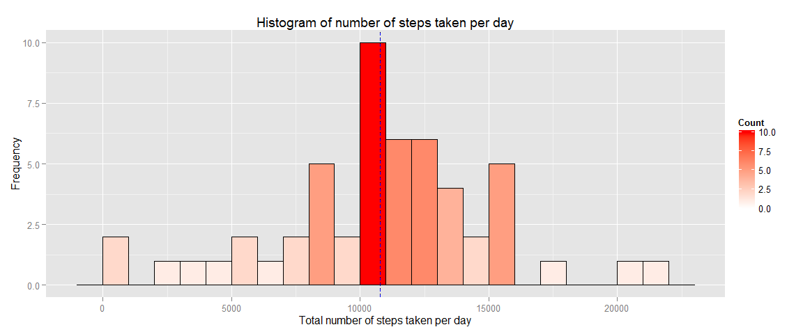
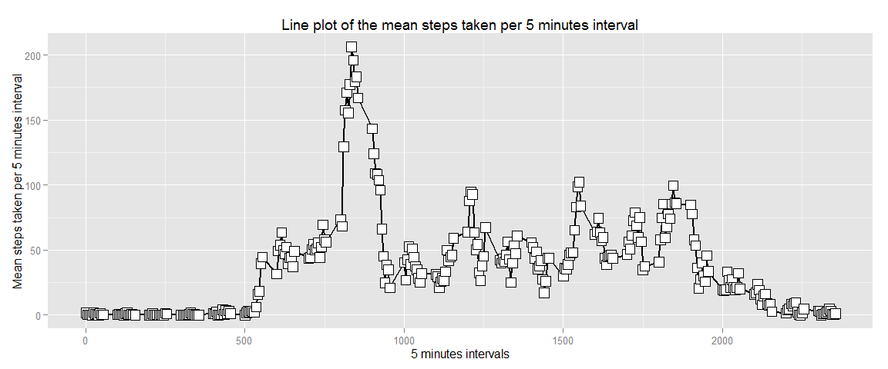

# Reproducible Research - Assignment 1
ManuelaS  
Sunday, October 18, 2015  
## STEP 0: Set working directory, load libraries and set global options


```r
# Set working directory
setwd("D:/coursera/reproducible_research/RepData_PeerAssessment1")
## Load libraries
# Use dplyr to manipulate data (install.packages('dplyr') if not installed already)
library(dplyr)
```

```
## 
## Attaching package: 'dplyr'
## 
## The following objects are masked from 'package:stats':
## 
##     filter, lag
## 
## The following objects are masked from 'package:base':
## 
##     intersect, setdiff, setequal, union
```

```r
# Use ggplot2 for plotting (install.packages('ggplot2') if not installed already)
library(ggplot2)
# Use chron to determine if a date is weekend or weekday
library(chron)
# Set global options for knitr
knitr::opts_chunk$set(fig.width=12, fig.heigh=8,fig.path='figure/')
```
## STEP 1: Loading and preprocessing data


```r
# Unzip data file and load in data
unzip('activity.zip')
data <-read.table('activity.csv',
                  sep=',',
                  header=TRUE,
                  colClasses=c('numeric','character','numeric'))
# Format date
data$date = as.Date(data$date,format='%Y-%m-%d')
# Check that data were succesfully imported and check data format
str(data)
```

```
## 'data.frame':	17568 obs. of  3 variables:
##  $ steps   : num  NA NA NA NA NA NA NA NA NA NA ...
##  $ date    : Date, format: "2012-10-01" "2012-10-01" ...
##  $ interval: num  0 5 10 15 20 25 30 35 40 45 ...
```

```r
head(data)
```

```
##   steps       date interval
## 1    NA 2012-10-01        0
## 2    NA 2012-10-01        5
## 3    NA 2012-10-01       10
## 4    NA 2012-10-01       15
## 5    NA 2012-10-01       20
## 6    NA 2012-10-01       25
```

```r
# Get summary of the data
summary(data)
```

```
##      steps             date               interval     
##  Min.   :  0.00   Min.   :2012-10-01   Min.   :   0.0  
##  1st Qu.:  0.00   1st Qu.:2012-10-16   1st Qu.: 588.8  
##  Median :  0.00   Median :2012-10-31   Median :1177.5  
##  Mean   : 37.38   Mean   :2012-10-31   Mean   :1177.5  
##  3rd Qu.: 12.00   3rd Qu.:2012-11-15   3rd Qu.:1766.2  
##  Max.   :806.00   Max.   :2012-11-30   Max.   :2355.0  
##  NA's   :2304
```
## STEP 2: What is the mean total number of steps per day?

1. Calculate the total number of steps taken per day (ignore missing values):


```r
# Filter out entries with missing data and aggregate (group_by) number of steps taken each day using the package dplyr
steps_per_day <- data %>% 
  filter(!is.na(steps)) %>%
  group_by(date) %>% 
  summarise(total_steps_per_day=sum(steps))
# Sanity check results of aggregation
str(steps_per_day)
```

```
## Classes 'tbl_df', 'tbl' and 'data.frame':	53 obs. of  2 variables:
##  $ date               : Date, format: "2012-10-02" "2012-10-03" ...
##  $ total_steps_per_day: num  126 11352 12116 13294 15420 ...
```

```r
head(steps_per_day)
```

```
## Source: local data frame [6 x 2]
## 
##         date total_steps_per_day
##       (date)               (dbl)
## 1 2012-10-02                 126
## 2 2012-10-03               11352
## 3 2012-10-04               12116
## 4 2012-10-05               13294
## 5 2012-10-06               15420
## 6 2012-10-07               11015
```

2. Make an histogram of the total number of steps taken per day and calculate their mean and median

I calculated the mean and median per day before making the plot, so that I could visualise these results on the histogram


```r
# Calculate mean and median steps taken per day
mean_steps_per_day <- mean(steps_per_day$total_steps_per_day,na.rm=TRUE)
median_steps_per_day <- median(steps_per_day$total_steps_per_day,na.rm=TRUE)

# Make histogram of steps taken per day and overlay mean and median
ggplot(data=steps_per_day,aes(steps_per_day$total_steps_per_day)) +
        geom_histogram(binwidth = 1000,
                 col='black',
                 aes(fill=..count..))+
  scale_fill_gradient('Count',low='white',high='red')+
  geom_vline(xintercept=mean_steps_per_day,linetype='dotted',col='black')+
    geom_vline(xintercept=median_steps_per_day,linetype='dashed',col='blue')+
  labs(title='Histogram of number of steps taken per day') +
  labs(x='Total number of steps taken per day', y='Frequency')+
  geom_density(col='black')
```

 

```r
mean_steps_per_day
```

```
## [1] 10766.19
```

```r
median_steps_per_day
```

```
## [1] 10765
```
The mean and median of the total number of steps taken per day are *10766.19* and *10765*, respectively. These results are also overalied on the histogram (black and blue lines for mean and median, respectively).

## STEP 3: What is the average daily activity pattern?

To visualise the mean activity broken down by a 5 minute interval for each day of the observation period I firstly computed the mean number of steps per 5 minutes interval and then plotted the results.


```r
steps_per_interval <- data %>% 
  filter(!is.na(steps)) %>%
  group_by(interval) %>% 
  summarise(mean_steps_per_interval=mean(steps))
ggplot(data=steps_per_interval,
      aes(x=interval,y=mean_steps_per_interval))+ 
    geom_line(colour='black',linetype='solid',size=1)+ 
    geom_point(colour='black',fill='white',size=5,shape=22)+
    labs(x='5 minutes intervals',
         y='Mean steps taken per 5 minutes interval',
         title='Line plot of the mean steps taken per 5 minutes interval')
```

 
To find out when the biggest number of steps were taken, I calculated the following:


```r
steps_per_interval$interval[which.max(steps_per_interval$mean_steps_per_interval)]
```

```
## [1] 835
```
## STEP 4: Inputing missing values

Missing values for days/interval are coded NA and may introduce bias in statistics computations.
Firstly, I assessed the number of entries with missing values:


```r
sum(is.na(data$steps))
```

```
## [1] 2304
```
Secondly, I decided to replace the missing values with zeros. I considered other options such as mean or median per interval/day inputation method. However, I hypothesised that the device was turned off whenever the user was not performing any activity and thus zero seems like the most appropriate inputation value.


```r
# Make a copy of the original dataset
data_no_missing <- data
# Replace missing values with zeros
missing_data_idx <- is.na(data_no_missing$steps)
data_no_missing$steps[missing_data_idx] <- 0
```
Check that all missing data have been inputted

```r
sum(is.na(data_no_missing$steps))
```

```
## [1] 0
```
Plot again the number of steps taken per day and calculate their mean and median with the dataset without missing values


```r
steps_per_day_no_missing <- data_no_missing %>% 
  filter(!is.na(steps)) %>%
  group_by(date) %>% 
  summarise(total_steps_per_day=sum(steps))

mean_steps_per_day_no_missing <- mean(steps_per_day_no_missing$total_steps_per_day,na.rm=TRUE)
median_steps_per_day_no_missing <- median(steps_per_day_no_missing$total_steps_per_day,na.rm=TRUE)

ggplot(data=steps_per_day_no_missing,aes(steps_per_day_no_missing$total_steps_per_day)) +
        geom_histogram(binwidth = 1000,
                 col='black',
                 aes(fill=..count..))+
  scale_fill_gradient('Count',low='white',high='red')+
  geom_vline(xintercept=mean_steps_per_day_no_missing,linetype='dotted',col='black')+
    geom_vline(xintercept=median_steps_per_day_no_missing,linetype='dashed',col='blue')+
  labs(title='Histogram of number of steps taken per day with no missing data') +
  labs(x='Total number of steps taken per day', y='Frequency')+
  geom_density(col='black')
```

 
The mean and median steps per day after inputation are: 

```r
mean_steps_per_day_no_missing
```

```
## [1] 9354.23
```

```r
median_steps_per_day_no_missing
```

```
## [1] 10395
```

To affect the percentage change caused by replacing missing values with zeros I calculated the following:

```r
(mean_steps_per_day_no_missing - mean_steps_per_day)/mean_steps_per_day*100
```

```
## [1] -13.11475
```

```r
(median_steps_per_day_no_missing - median_steps_per_day)/median_steps_per_day*100
```

```
## [1] -3.437065
```

## STEP 5:Are there differences in activity pattern between weekdays and weekends?

To assess wheter there are any emerging patterns in activities during weekdays versus weekends, I firstly created a new column with the information wheter or not the date under study belong to a weekday (Monday to Friday) or weekend (Saturday and Sunday).
The column was created exploiting the function is.weekend from the library chron and the function ifelse.
Subsequently, a plot line broken down by weekday and weekend was created using ggplot2 library


```r
data_no_missing$day_type<-ifelse(is.weekend(data_no_missing$date),'weekend','weekday')

steps_per_day_type <- data_no_missing %>%
  group_by(interval,day_type) %>%
  summarise(mean_steps_per_day_type = mean(steps))

ggplot(steps_per_day_type,aes(x=interval,y=mean_steps_per_day_type,color=day_type)) +
  geom_line() +
  facet_wrap(~day_type,ncol=1,nrow=2)+
  labs(x='Interval',y='Mean steps per day type',title='Mean steps broken down by day type')
```

 
By comparing the two plots, I can identify different patterns between working days versus weekends. During weekdays there is more walking activity than during the weekends and the walking is also more focussed on specific time intervals. In contrast over the weekend there are less steps taken in average and the activity seems to be more distributed across intervals. These differences mirror the diversity of situations that we encounter in our working life with a set schedule and our more flexible schedule over the weekend when we relax.
